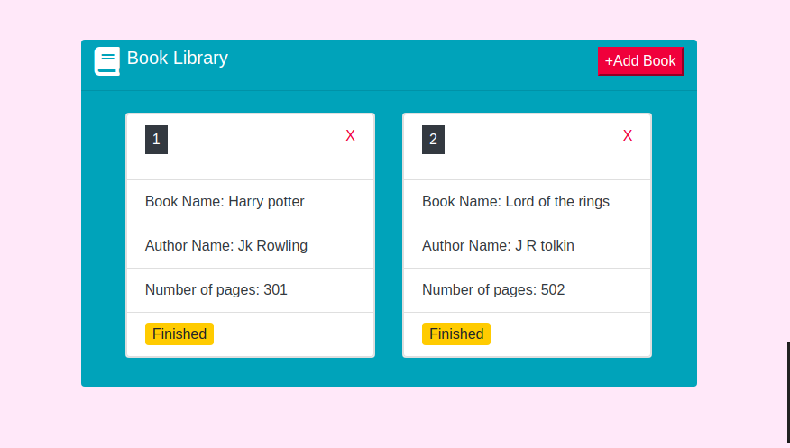

# Library-js

> This is a Microverse javascript project that allows users to book to a library.It allows user to add books, delete books, change reading status. User can also track how many books are there in the library.



## Features
In this project we developed a simple javascript library app that includes:

- The form uses Bootstrap library for css combined with javascript code
- User can add books to library with name,author name, page numbers and reading status.
- User can delete book from the library.

## Built With

- javascript
- vscode
- Atom text editor
- fontawesome
- Bootstrap
- stylelint
- eslint
- npm

# Getting Started

To get a local copy of the repository please run the following commands on your terminal:

```
$ cd <folder>
```

```bash
$ git clone `https://github.com/ajkacca457/Library-js.git`
$ cd Library-js
$ Open the index.html file using your favorite browser
```
## Live vesion
[click here](https://basiclibrary.netlify.app/)

# Authors

👤 **Avijit Karmaker**

- Github: [@Avijit](https://github.com/ajkacca457)
- Linkedin:[Avijit Karmaker](https://www.linkedin.com/in/avijit-karmaker-8738a54)

👤 **Umair Ahmad**

- Github: [@umairahmad125](https://github.com/UmairAhmad125)
- Linkedin:[Umair Ahmad](https://www.linkedin.com/in/umair-ahmad-b5a89015a/)
- Twitter:[Umair Ahmad](https://twitter.com/umairahmadDP)

## 🤝 Contributing

Contributions, issues and feature requests are welcome!

## Show your support

Give a ⭐️ if you like this project!

## Copyright
This is a project developed by Microverse Student as the part of skill curriculum.
